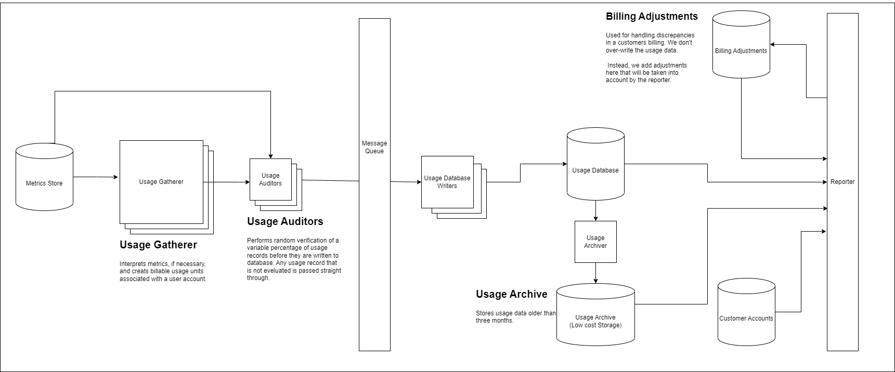

# Usage-Based Billing Design

The purpose of this document is to outline a design strategy for a prototype of a usage-based billing system for a Canopy take-home assignment. The billing system will only take into account the following properties:

- Storage
- Compute
- Bandwidth

Starting from what the customer will see, the billing statement should look something like the following:


## Requirements

The system in question will express the following requirements:

### Functional

- A user shall be able to pull up-to-date information of a customer's billing data.
- A user shall be able to pull past customer billing statements.
- A user shall be able to make adjustments to customer billing statements.

\
&nbsp;
\
&nbsp;
\
&nbsp;

<p align="center" width="100%">
    
</p>

### <ins>Metrics Store

The metrics store holds metrics related to usage. The final implementation will more than likely be stored in Google Cloud Metrics, but for this implementation, the store will be mocked with in code. I am currently making an assumption that the ability to relate a customer with a service event is implemented within the store service.

### <ins>Customer Accounts Database

The customer accounts database contains all information related to our customer. This database will be used by the reporter to get needed pricing information for our customers when creating the usage statement.

### <ins>Usage Interpreter

The usage interpreter analyzes the individual usage events to provide billable usage units.

```
guest/cpu/usage_time BETA
CPU usage

CUMULATIVE, DOUBLE, s{CPU}
gce_instance

CPU usage, in seconds. For Container-Optimized OS, or Ubuntu running GKE.
instance_name: The name of the VM instance.
state: One of the following: idle, interrupt, nice, softirq, steal, system, user, wait.
```

```
storage/total_bytes GA
Total bytes

GAUGE, DOUBLE, By
gcs_bucket

Total size of all objects in the bucket, grouped by storage class. This value is measured once per day, and there might be a delay after measuring before the value becomes available in Cloud Monitoring. Once available, the value is repeated at each sampling interval throughout the day. Buckets with no objects in them are not tracked by this metric. For this metric, the sampling period is a reporting period, not a measurement period. Sampled every 300 seconds. After sampling, data is not visible for up to 600 seconds.
storage_class: Storage class of the data.
```

**Compute**

```
{
   "customer": "123456789012",
   "type": "compute"
   "timestamp": 123456789
   "usage": 200045,
}
```

**Storage**

```
{
   "customer": "123456789012",
   "type": "storage"
   "timestamp": 123456789
   "usage": 2270000,
}
```

**Bandwidth**

```
{
   "customer": "123456789012",
   "type": "bandwidth"
   "timestamp": 123456789
   "usage": 200045,
}
```

### <ins>Auditor

### Billing Database Writers

### <ins>Billing Database

### <ins>Billing DatabaseArchiver

### <ins>Billing Archive

### <ins>Billing Adjustments

### <ins>Reporter Builder</ins>

```
{
   "customer": "123456789012",
   "start": 123456789,
   "end": 133456789,
   "currency": "usd",
   "tier": "platinum",
   "compute: {
       "usage": 2000045,
       "cost": 278.32
   },
   "storage: {
       "usage": 2270000,
       "cost": 976.23
   },
   "bandwidth": {
       "usage": 200345200045,
       "cost": 1234.56
    }
}
```
