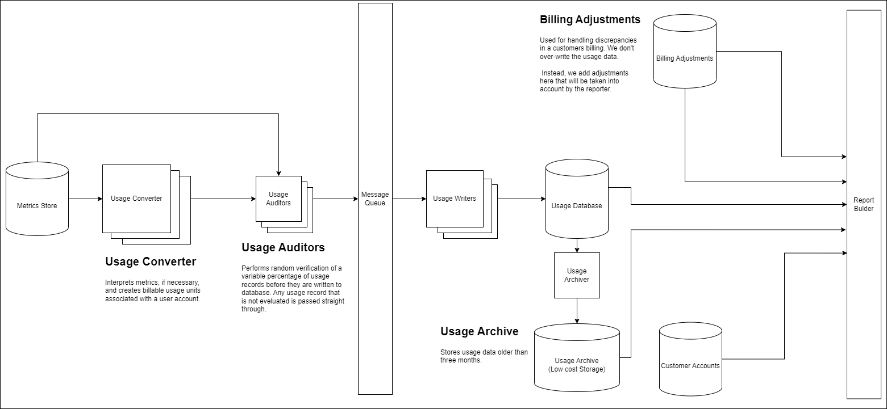
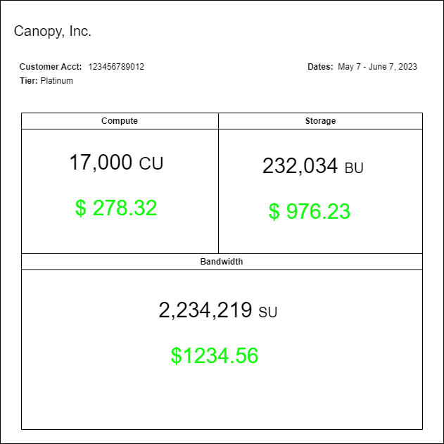

# Usage-Based Billing Design

## Introduction

### 1.1 Purpose

The purpose of this document is to outline a design strategy for a prototype of a usage-based billing system for a Canopy take-home assignment. The billing system will only take into account the following properties:

- Storage
- Compute
- Bandwidth

### 1.2 Scope

This document is intended to give a detailed description of the functionality need to accomplish the implementation of a Metrics-centric Usage-based Billing system. That coverage dose not include the following aspects of our system.

- Definition or collection of Metrics
- Payment system
- Definition of customer pricing structure
  - The system will be flexible enough to handle change in pricing

### 1.3 Requirements

The system in question will express the following requirements:

- A user shall be able to pull up-to-date information of a customer's billing data.
- A user shall be able to pull past customer billing statements.
- A user shall be able to make adjustments to customer billing statements.

## System Overview

### **Architecture**



## Detailed Design

Our design will make use of a **Per-unit** billing model. The per-unit model will give us a metric for each property and is relatively simple to convert to a **tiered**, **volume-based**, and or **overage** model in the future, if necessary.

Starting from what the customer will see, the billing statement should look something like the following:



**<ins>Metrics Store</ins>**

> The metrics store holds metrics related to usage. The final implementation will more than likely be stored in Google Cloud Metrics, but for this implementation, the store will be mocked in code. I am currently making an assumption that the ability to relate a customer with a service event is implemented within the store service.

**<ins>Customer Accounts</ins>**

> The customer accounts database contains all information related to our customer. This database will be used by the reporter to get needed pricing information for our customers when creating the usage statement.

**<ins>Usage Converter</ins>**

> The usage converter analyzes the individual usage events to provide billable usage units (BU, CU, SU).

**Usage Event**

```
{
   "customer": "123456789012",
   "type": "[compute|storage|bandwidth]"
   "timestamp": 123456789
   "units": 2023,
   "created": 123456789
}
```

**<ins>Usage Auditor</ins>**

> The usage auditor will audit a percentage of the converted usage events for accuracy. If is finds an error, the usage event will be quarantined, an alarm will be raised, and conversion will be halted for further inspection. Auditing will need more information than the usage event currently has. I will know more about the proper way to audit once I do more research on the metrics system. Perhaps, if there is a metric ID, we can store it in the usage event to have a record of where the usage event was derived.

**<ins>Usage Writers</ins>**

> The purpose of the usage writers is to pull usage events from the Message Queue and write them to the Usage Database.

**<ins>Usage Database</ins>**

> Contains all usage events for all customers that have occurred within the last three months.

**<ins>Usage Archiver</ins>**

> Removes all usage events older than three months from the usage database and writes them to the Usage Archive.

**<ins>Usage Archive</ins>**

> Stores all usage events older than three months.

**<ins>Billing Adjustments</ins>**

> The adjustments database holds corrections to customer billing charges. This is so we do not contaminate the original usage data.

**<ins>Report Builder</ins>**

> The Report Builder is responsible for pulling data from the Usage Database, Customer Accounts, and Billing Adjustments to create a usage billing statement. Based on the image of the user statement above, we will return an object similar to the following:

```
{
   "customer": "123456789012",
   "start": 123456789,
   "end": 133456789,
   "currency": "usd",
   "tier": "platinum",
   "compute: {
       "units": 2000045,
       "cost": 278.32
   },
   "storage: {
       "units": 2270000,
       "cost": 976.23
   },
   "bandwidth": {
       "units": 200345200045,
       "cost": 1234.56
    }
}
```
